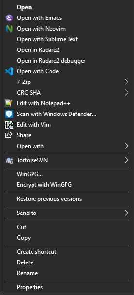

Even after all these years, Emacs is still one of the best text editors out there, but it does not work flawlessly on Windows. Today, I will show you how to make Emacs integrate with Windows like some of the modern text editors do.

Step 1: Making Emacs daemon start on Windows startup
Press __Win+R__ to open the *Run* dialog and enter *shell:startup* and press Enter. A Windows Explorer window will pop up. Then create a new text file and rename it *emacs.bat*; open it in a text editor. Then write 

```runemacs --daemon``` 

in the text file (make sure Emacs is in the *PATH*). Next time you start your computer, Emacs will start along with all other applications. You will also be able to see it in Task Manager Startup section.

Step 2: Creating Open With Emacs context menu entry using the registry editor

Press __Win+R__ to open the *Run* dialog and enter *regedit*. From the top-level, open *HKEY\_CLASSES\_ROOT* and navigate to __\*__ submenu. It will most likely be at the top of the list. From there open the __shell__ submenu and create a new *Key* inside it.

Name the new key __Open With Emacs__. Open the newly created key and create another Key inside it and call it command. Inside the command menu, you will be able to see a string value titled **(Default)**; right-click it and select *Modify*. Enter the path to your *emacsclientw.exe* executable and append __-c "%1"__ to it.

If you wish, you can set an icon to your context menu entry by opening the *Open With Emacs* key and creating a new *String* value titled __Icon__. Enter the path to your *runemacs.exe* file and hit F5. Your context menu entry is now ready.
