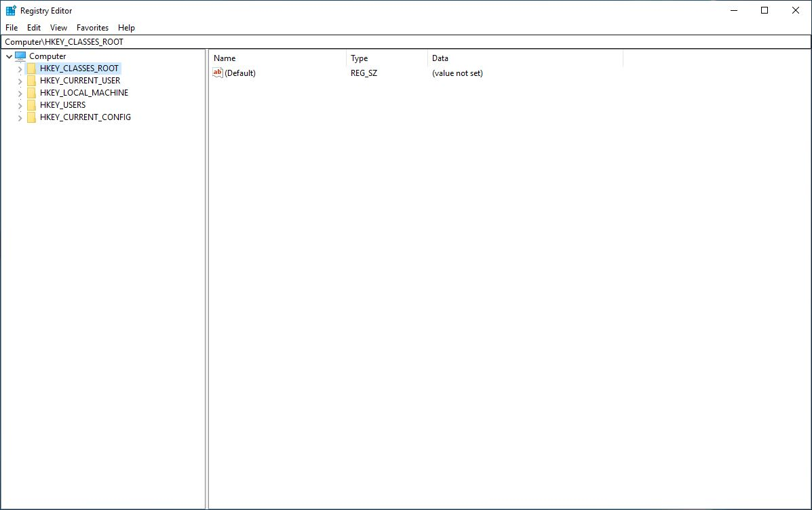
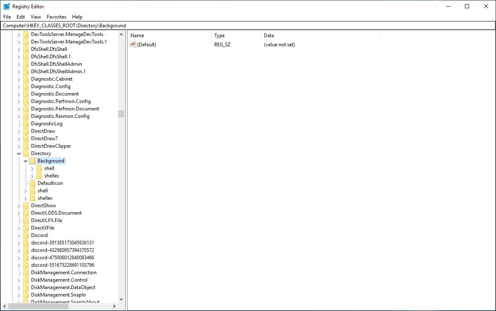
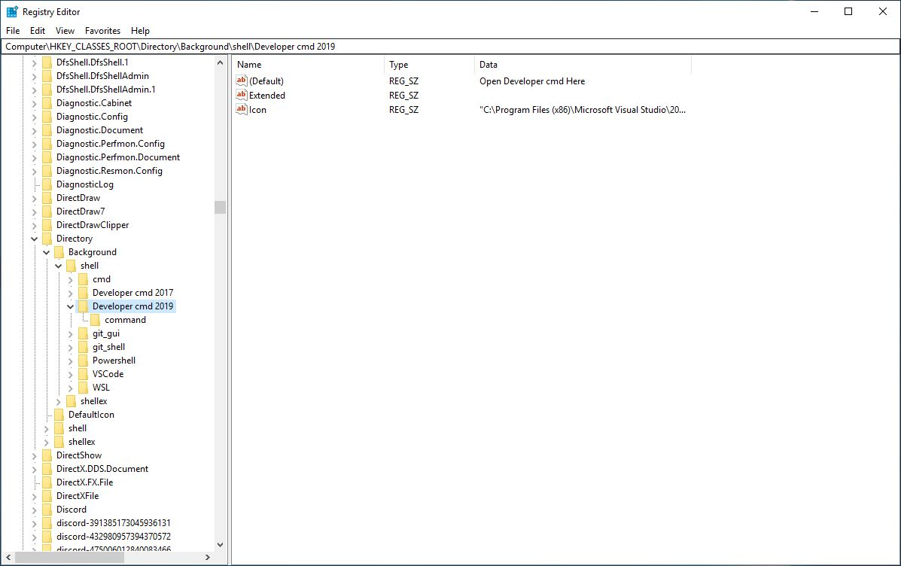
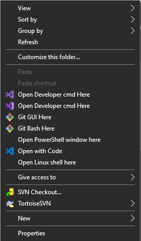

I like Visual Studio, but I do not prefer working with it all the time.

Sometimes when I’m just writing code that I know would work, I don’t bother firing up Visual Studio; I prefer writing it in Emacs or Vim and then use MSBuild to build the project.
But, to use MSBuild, we need to start Visual Studio Command Prompt which starts up in the install location of Visual Studio and then we need to cd to our project directory.

It works okay if you just need to start the cmd once and use it for the rest of the time you’re writing code; that is not how I use it.
You can create a batch file which does the steps mentioned above and put it in the project directory, but if multiple people are working on the project and they do not have Visual Studio installed in the same location, it would be a problem.

It would also not be convenient to copy the batch file in every project.

Example of the batch file:

```cmd /k call “<path to vsvarsall.bat>”```

Hence, a better solution to this problem is to create a registry key that would open the Visual Studio Command Prompt in our current workspace.

First, open up the Registry Editor by __Win + R__ -> __regedit__ (You may want to create a system restore point just in case something goes wrong).
 

Expand *HKEY\_CLASSES\_ROOT* and find *Directory* and expand it. Then expand *Background* and then *shell*.
 

Right-click on 'shell' and select __New -> Key__. Call the new key “Developer cmd 2019“.

Select the key you just created and select *(Default)* and modify its value to “Open Developer cmd Here“

Right-click on the key and select __New -> String Value__ and call it *Icon*. Modify its value to the path of your Visual Studio *devenv.exe*. It will enable you to have the icon of the Visual Studio version you are creating the registry entry for.
 

Right-click the key and select __New -> Key__ and call it “command“. Select the new key and Right-Click and Modify its value to be 

```cmd.exe /k call “<path to vsvars64.bat>”```

You can use *vsvars32.bat* or *vsvarsall.bat* as well.

Press F5 to refresh the system and then go to your project directory and *Shift + Right-Click* to start using the developer command prompt from any directory.
